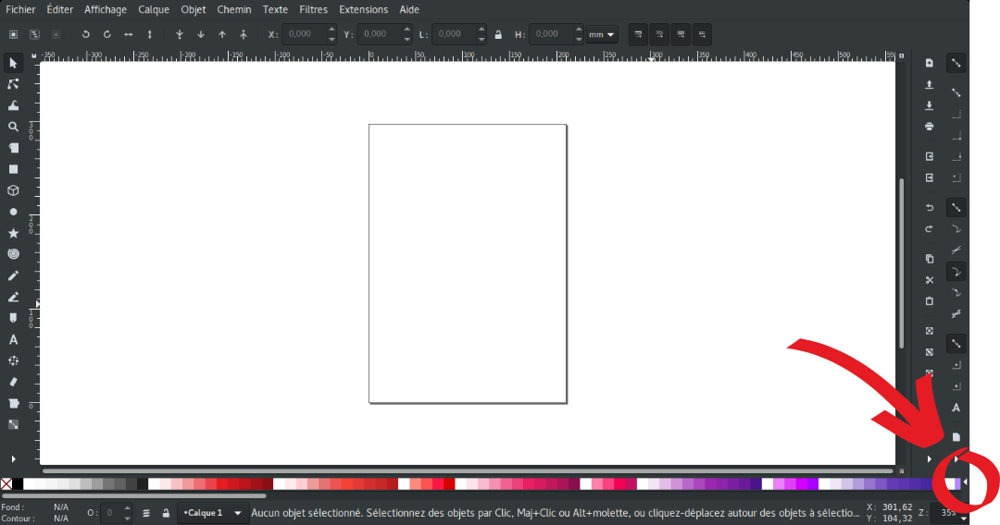

# Les palettes de couleur sur Inkscape

Une palette de couleur est un fichier *.gpl* placé dans le dossier `~/.config/inkscape/palettes/` pour linux et `C:\ProgramFiles\Inkscape\share\palettes\` pour Windows. Il doit être codé de cette manière :

```text
GIMP Palette
Name: Nom de votre palette
#
0 0 0 #000000
255 255 255 #FFFFFF white
250 250 250 #fafafa
... liste de vos couleurs.
```

Notez que les 3 premières lignes sont obligatoires et que seul le nom de la palette doit changer.

Les lignes de couleur commencent après le "#" en ligne trois, elles sont constituées de trois valeurs RGB séparées par des escapes, peut suivre optionnellement le code hexa et/ou le nom de la couleur. 

Le chargement de votre palette se fera automatiquement à l'ouverture d'Inkscape.

La liste des palettes de couleur est disponible via la flèche à droite de la palette de couleur en bas de l'écran.



*Actus :* Dans un projet web comme votre projet tutoré, créez-vous une palette de couleur lié à votre charte graphique et ajoutez la à votre projet git, vous pouvez rapidement la mettre à jour avec cette ligne de commande :

```bash
cp ma_palette.gpl ~/.config/inkscape/ma_palette.gpl
```

(depuis le répertoire contenant votre palette)