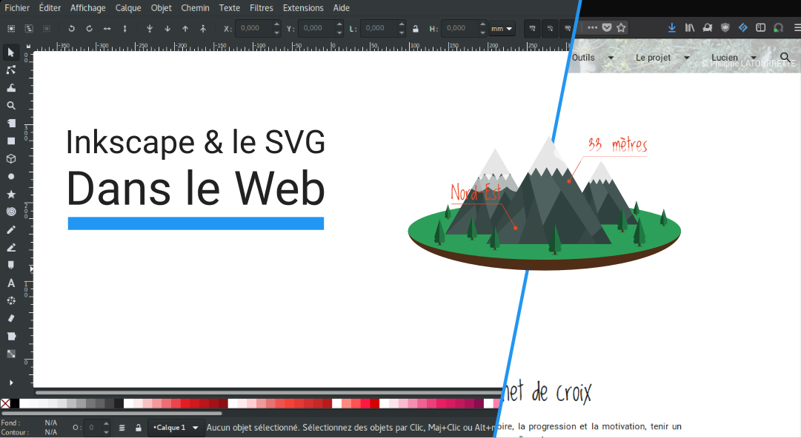

# Le SVG pour le WEB & Inkscape

Dans ce cours nous allons voir comment utiliser Inkscape pour faire des maquettes de site web, des logos, CV et autres infographies.

Nous verrons ensuite comment intégrer le SVG dans le web, ses subtilités par rapport au responsive, et nous générons une font-icône en automatique avec Grunt.

## Sommaire

**Inkscape :**

- [Les palettes de couleur](Palettes/README.md)

**Le Web :**

- [Rendre le SVG responsive](Responive/README.md)
- [Créer une font à partir d'icône SVG](Icons/README.md)

